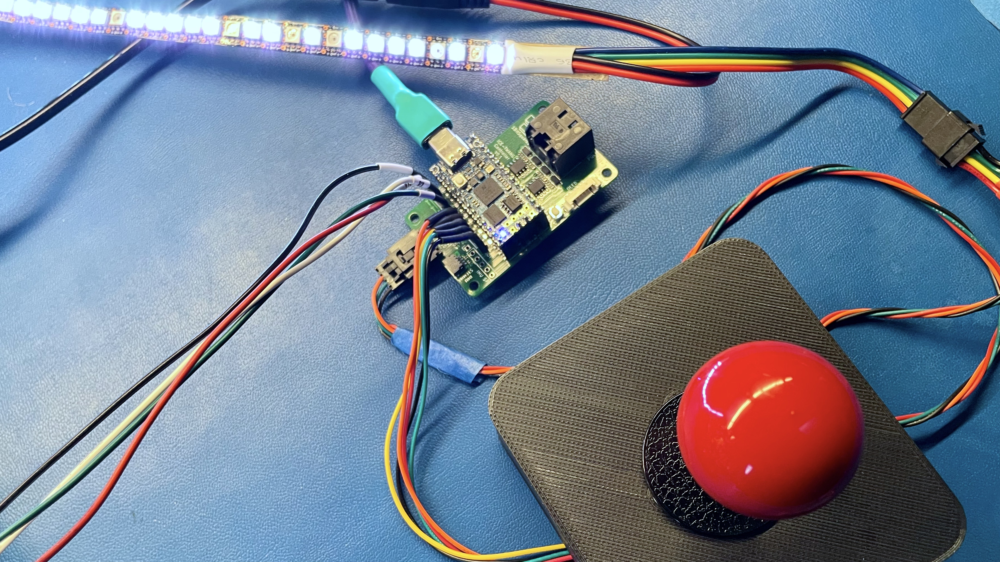
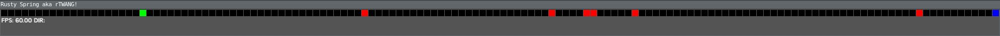

The iCEBreaker-Bitsy FPGA based 1D LED game system.

This repository contains hardware, gateware and firmware for the system.

**The minimum vaiable setup, using the iCEtwang controller board, an APA102 LED strip and an arcade joystick**

# What is it

The original intention was to implement a [TWANG](https://www.buildlog.net/blog/2018/01/twang/)
inspired game, using FPGA instead of a microcontroller. In turn TWANG was inspired by the game
called [Line Wobbler](https://wobblylabs.com/projects/wobbler).

The scope of the project has expanded a bit since it's inception. The added
goals are multiplayer and remote LED strings, as well as additional games
beyond the 1D Dungeon game that the predecessor TWANG game implemented.

# Simulator

This repository also contains a simulator that allows you to play the game on
the desktop using keyboard arrow keys. It is very useful to try out the game
without the hardware, as well as debugging and development of the games.

**The iCEtwang simulator window**

You can find it in the `sim` subdirectory.

## How to build the hardware

TODO: Hardware build information goes here...

## How to build the gateware

* Connect the iCEBitsy in DFU bootloader mode to your computer.
* In the `soc/ice-twang` directory run `make dfuprog`

## How to build the firmware

* Connect the iCEBitsy in DFU bootloader mode to your computer.
* In the `firmware/icetwang-controller` or `firmware/icetwang-pole` directory
  run `cargo run --release`

## More information

You should be able to find some more README.md files distributed around this
repository, describing more details of each of the system components.

If you have questions you can always join [our discord
server](https://1bitsquared.com/pages/chat) and ask questions there.
